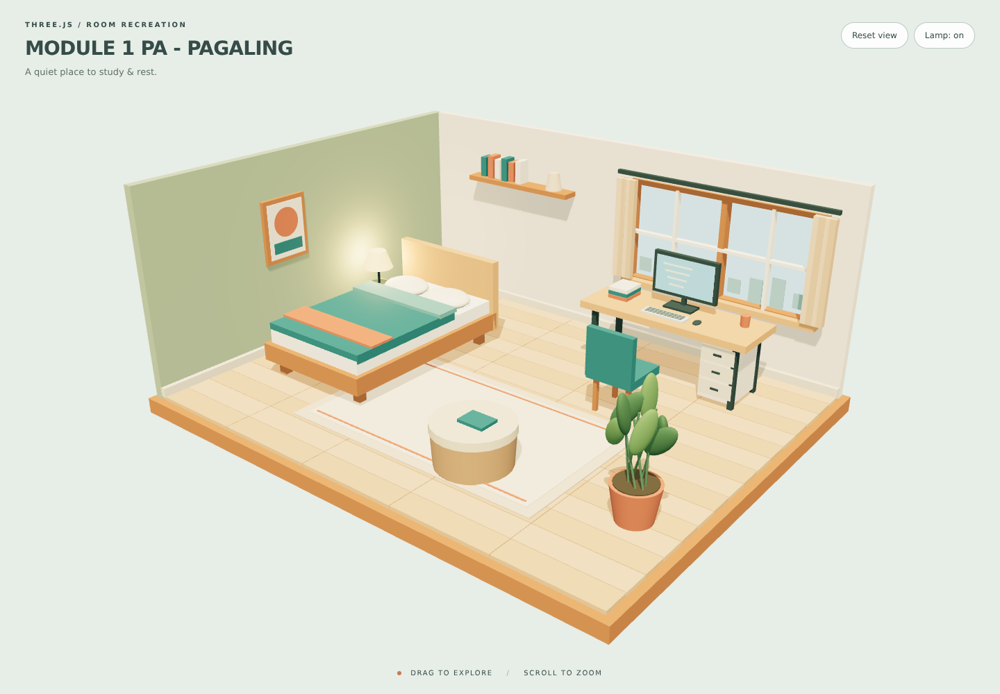

# MODULE 1 PA - PAGALING

An original Three.js bedroom recreation by Harvey Ivan Uy Pagaling.



## Run

Use VS Code Live Server on `index.html`, or open a terminal in this folder and run:

```sh
python -m http.server 8000
```

Visit **http://localhost:8000**. On Windows, `py -m http.server 8000` also works with Python installed. Serve the folder through HTTP rather than double-clicking the HTML because the JavaScript uses ES modules.

No npm install, build step, or external CDN is needed. Three.js 0.186.1 and OrbitControls are included under `vendor/three/`, with the upstream MIT license. Requires a browser with WebGL 2 and hardware acceleration.

## Controls

- Drag with the mouse or one finger to orbit the room.
- Scroll or pinch to zoom.
- **Reset view** restores the initial camera angle.
- **Lamp: on/off** switches the bedside light.

## Assignment requirements

- Exact browser title: **MODULE 1 PA - PAGALING**.
- Full-screen canvas with responsive resizing.
- Bed with a frame, mattress, pillows, duvet, and folded blanket.
- Study area with table, monitor, keyboard, mouse, drawers, and chair.
- Two framed windows with curtains and a simple skyline.
- Additional objects: bedside table and lamp, books, shelf, framed artwork, rug, stool, and floor plant.
- All room objects are constructed in JavaScript from built-in Three.js geometries. No imported 3D models, images, or textures.
- External JavaScript and CSS files, with descriptive variable and function names.

## Files

- `index.html`: page, import map, and controls.
- `css/style.css`: full-screen layout and interface styling.
- `js/main.js`: geometries, materials, scene, camera, lights, interactions, and rendering.
- `vendor/three/`: locally included Three.js library and controls.
- `preview.png`: actual rendered desktop screenshot.

## Validation

Tested in Chromium with WebGL rendering at desktop 1440 × 1000, portrait 390 × 844, and landscape 844 × 390. Verified the exact title, required furniture and windows, rendered geometry, canvas size, orbit dragging, reset view, and lamp switch. No JavaScript errors or failed resource requests occurred during the checks.

Three.js documentation: https://threejs.org/docs/
